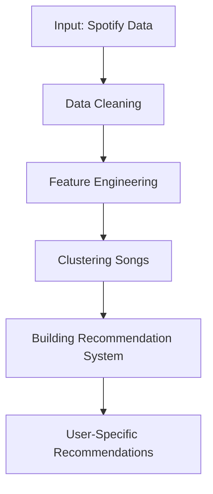

# Spotify Music Recommendation System 🎵
A Python project leveraging clustering and machine learning to recommend songs based on user preferences. This project is documented using Jupyter Book for a step-by-step explanation of the data processing, modeling, and evaluation process.

## Table of Contents
- Introduction
- Features
- How It Works
- Installation
- Usage
- Interactive Documentation
- Technologies Used
- Future Applications
- Acknowledgements

## Introduction
With millions of songs available online, finding personalized music recommendations is a challenge. This project addresses this issue by analyzing Spotify music data, clustering songs based on audio features, and building a recommendation system that tailors results to user preferences.

The project is presented in a Jupyter Book for interactive exploration and educational purposes.

## Features  
- **Data Cleaning:** Preprocess and clean Spotify audio feature data.  
- **Clustering Songs:** Group songs based on features such as tempo, energy, and danceability using k-means clustering.  
- **Recommendation Engine:** Recommend songs by matching user preferences to song clusters.  
- **Model Evaluation:** Use machine learning techniques to validate recommendation accuracy.  
- **Interactive Documentation:** Explore the project step-by-step using Jupyter Book.  

---

## How It Works  
1. **Input Data:** Spotify dataset containing audio features like tempo, energy, and acousticness.  
2. **Processing:**  
   - Clean and prepare the data.  
   - Cluster songs using k-means based on audio features.  
3. **Recommendation:**  
   - Use the clusters to suggest songs tailored to user preferences.  
   - Evaluate the system using precision and recall metrics.  

Here’s a quick workflow diagram:  

## Technologies Used
- Python: pandas, scikit-learn, matplotlib.
- Jupyter Book: For documentation and tutorials.
- Spotify API: For data and feature extraction.
- GitHub & Binder: For version control and interactive hosting.
  
## Future Applications
- Music Platforms: Enhance playlist curation on platforms like Spotify or Apple Music.
- User Personalization: Tailor recommendations based on user-specific listening history.
- Education: Use this project to teach clustering and recommendation algorithms.

## Acknowledgements
- Kaggle for providing the dataset.
- OpenAI for assisting with Python and recommendation techniques.
- Jupyter Book for creating an interactive documentation platform.

